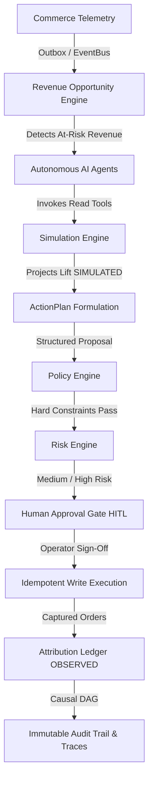

# Flowmint AI — Bounded-Autonomy Revenue Operating System

> **Turn every commerce signal into a governed, high-ROI revenue action.**  
> *Live Fireworks inference and structured tool calling have been verified. Cloud deployment remains credential-gated unless actually deployed.*

[](docs/testing.md)
[](docs/testing.md)
[](frontend)
[](docs/evaluation.md)
[](docs/security.md)

---

## 💡 What is Flowmint AI?

Flowmint AI is a **competition-ready, bounded-autonomy revenue operating system** for digital merchants. It transforms commerce telemetry (abandoned carts, checkout failures, inventory imbalances, bundle affinities) into safe, policy-verified, human-approved growth actions that directly recover revenue.

### Why Does It Exist?
Modern e-commerce operators face a painful dilemma:
1. **Traditional Dashboards:** Static charts tell merchants they lost ₹1,42,000 in abandoned carts, but require manual, time-consuming effort to diagnose and act.
2. **Unbounded Black-Box AI:** Naive LLM chatbots or agents given direct database write access make disastrous hallucinations—offering 90% unintended discounts, spamming buyers, or corrupting inventory state.

**Flowmint AI solves this through Bounded Autonomy:**
- Agents are **strictly read-only** by default.
- Revenue opportunities are backed by **inspectable quantitative telemetry**.
- Interventions are simulated using **What-if deterministic arithmetic**.
- Action proposals must pass a **hard-coded Merchant Policy Engine**.
- High and medium-risk actions require **Human-in-the-Loop (HITL) approval**.
- Tool execution is **atomic, idempotent, and reversible**.
- Revenue outcomes are labeled with strict attribution distinctions (**`OBSERVED`** vs **`SIMULATED`**).

---

## 🏛️ System Architecture



### Technology Stack
- **Frontend SPA:** React 18, Vite, TypeScript, Tailwind CSS, Lucide icons, Vitest.
- **Backend API:** Python 3.11, FastAPI, Pydantic v2, SQLAlchemy 2.0 (Async), Uvicorn.
- **Primary Database:** PostgreSQL 16 (Relational schemas, multi-tenant composite isolation, foreign keys, Alembic migrations).
- **In-Memory Cache & Lock:** Redis 7 (Distributed idempotency locks, safe read caching, rate limiting).
- **Payment Processing:** Razorpay (TEST MODE with cryptographic HMAC SHA-256 signature verification).
- **AI Infrastructure:** Flowmint AI uses Fireworks AI's Qwen 3.8 Max model for live inference (`accounts/fireworks/models/qwen3p8-max`). MockLLM remains available for deterministic regression testing. Multi-provider interface also supports OpenAI, Anthropic, and Google.

---

## 🤖 AI Agents & Behavior

Flowmint AI features four specialized, persona-bounded commerce agents:

| Agent | Scope & Permissions | Key Tools |
| :--- | :--- | :--- |
| **Buyer Agent** | Customer storefront shopping assistant with grounded catalog search | `search_products`, `check_inventory`, `compare_products` |
| **Analytics Agent** | Merchant intelligence querying sales metrics, conversion rates, and revenue run-rate | `get_revenue_summary`, `get_conversion_summary`, `get_product_performance` |
| **Growth Agent** | Cross-sell and bundle discovery using co-purchase frequency algorithms | `get_frequently_bought_together`, `get_inventory_health` |
| **Recovery Agent** | Cart and checkout abandonment detection and bounded recovery | `get_abandoned_carts`, `get_failed_payments`, `get_recovery_candidates` |

---

## 🛡️ Safety & Governance Architecture

1. **Deterministic Rule Enforcement:** The Policy Engine enforces non-negotiable merchant rules (e.g., max 15.0% discount cap, campaign budget ceiling, 24h customer contact cooldown).
2. **Fail-Closed Execution:** Empirically verified to fail closed across tested scenarios: any policy violation, LLM timeout (>10s), expired approval (>24h), or schema mismatch immediately halts execution without modifying state.
3. **Idempotency Locks:** Every mutating action requires a unique idempotency key. Duplicate requests return the existing execution record without duplicate voucher generation or customer notifications.
4. **Attribution Distinctions:**
   - **`SIMULATED`:** Pre-flight forward projections from What-if simulations.
   - **`ESTIMATED`:** Model projections in ActionPlan proposals before execution.
   - **`OBSERVED`:** Actual recorded customer transactions and captured payments in the database.
   - **`DETERMINISTIC EVENT LINK`:** Direct voucher or cart linkage (does not imply generalized causality).

---

## 🧭 Live Interactive Judge Mode (`/judge`)

For evaluators and competition judges, Flowmint AI includes an end-to-end interactive 12-step guided experience at `/judge`:

1. **Revenue Command Center** (Store health, GMV, ₹1,42,000 at-risk alert)
2. **Detected Opportunity** (37 abandoned checkouts detected in last 24h)
3. **Inspectable Evidence** (Raw telemetry JSON & baseline statistics)
4. **AI Investigation** (Recovery Agent reasoning & read-only tools)
5. **What-if Simulation** (10% discount test projecting ₹34,533 lift `SIMULATED`)
6. **ActionPlan Formulation** (`PROPOSED` status, bounded coupon parameters)
7. **Policy Check** (9 merchant rules verified; toggle to test blocked 25% discount)
8. **Risk Classification** (`MEDIUM` risk assigned &rarr; auto-approval forbidden)
9. **Approval Gate** (Human operator review and cryptographic signature)
10. **Execution** (Controlled write tool `apply_cart_recovery_offer` with idempotency lock)
11. **Outcome** (3 completed orders, ₹9,850 gross, **+₹8,865 net impact** labeled `OBSERVED`)
12. **Trace / Audit** (Full 12-node causal DAG provenance graph)

---

## 🧪 AI Evaluation Benchmark (900 Cases)

Flowmint AI features a rigorous 900-case evaluation suite across 7 distinct categories:

- **500 Buyer Queries:** Complex semantic search, catalog filtering, anti-hallucination inventory checks.
- **100 Analytics Queries:** Multi-period sales aggregations and conversion calculations.
- **100 Growth Queries:** Co-purchase recommendations and bundle affinity discovery.
- **50 Recovery Queries:** Abandoned cart identification and eligibility verification.
- **50 Adversarial Policy Bypass Attempts:** Prompt injections attempting discounts > 15% (100% blocked).
- **50 Direct Prompt Injections:** Jailbreaks attempting privilege escalation (100% neutralized).
- **50 System Failure / Degraded Cases:** Network timeouts and malformed JSON payloads (100% fail-closed).

> **MockLLM vs Real LLM Separation:** MockLLM regression runs are strictly separated from Real LLM evaluations. On Flowmint's 900-case evaluation suite, the Fireworks Qwen3.8 Max configuration achieved the measured evaluation result under the documented test protocol. Mock latency is never conflated with cloud provider latency.


---

## 🚀 Quick Start & Local Setup

### 1. Prerequisites
- Docker & Docker Compose
- Python 3.11+
- Node.js 20+

### 2. Launch Local Infrastructure
```bash
# Clone repository
cd "Flowmint AI"

# Start PostgreSQL and Redis containers
docker compose up -d postgres redis
```

### 3. Backend Setup
```bash
cd backend
python -m venv .venv
.venv\Scripts\activate       # Windows (.venv/bin/activate on Unix)
pip install -r requirements.txt
alembic upgrade head
python -m app.seed           # Seeds TechMart India with 37 carts, policies, products
uvicorn app.main:app --reload --port 8000
```

### 4. Frontend Setup
```bash
cd ../frontend
npm install
npm run dev                  # Launches frontend at http://localhost:5173
```

### 5. Access Credentials
- **Merchant Portal:** `http://localhost:5173`
- **Email:** `admin@techmart.in`
- **Password:** `admin123`
- **Direct Judge Walkthrough:** `http://localhost:5173/judge`
- **Customer Storefront:** `http://localhost:5173/store`

---

## ☁️ Staging & Deployment (Prepared)

Flowmint AI is staging-ready for standard cloud topologies (all deployment manifests are prepared and locally validated; remote cloud deployment is credential-gated):
- **Frontend:** Vercel (Configured via `frontend/vercel.json` with SPA routing and security headers).
- **Backend:** Render or AWS ECS (Configured via `render.yaml` and `backend/Dockerfile`).
- **Database:** Managed PostgreSQL (AWS RDS / Neon / Render Postgres).
- **Redis:** Managed Redis (AWS ElastiCache / Upstash / Render Redis).
- **Payments:** Razorpay in TEST MODE.

See the complete [Cloud Deployment Guide](docs/deployment.md).

---

## 📚 Complete Documentation Index

- [Competition Demo Script](docs/demo-script.md)
- [Architecture & Deep Dive](docs/architecture.md)
- [AI Architecture & Agent Registry](docs/ai-architecture.md)
- [AI Evaluation & 900-Case Benchmark](docs/evaluation.md)
- [Revenue Attribution Engine](docs/revenue-attribution.md)
- [Observability & Trace DAGs](docs/observability.md)
- [Security & Adversarial Guarantees](docs/security.md)
- [Production Readiness Audit](docs/production-readiness.md)
- [Cloud Staging Deployment](docs/deployment.md)
- [Known Limitations & Non-Goals](docs/known-limitations.md)
- [API Contracts & Endpoints](docs/api-contracts.md)
- [Database Relational Design](docs/database-design.md)
- [Testing Verification Report](docs/testing.md)
- [Architecture Decision Records (ADRs)](docs/decisions/adr-index.md)

---

## ⚖️ License
Proprietary — Flowmint AI All Rights Reserved.
